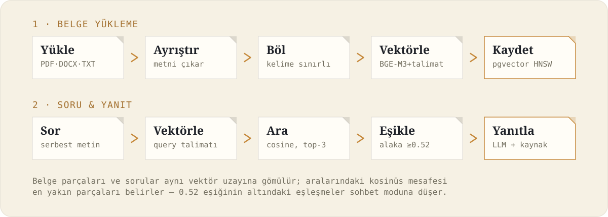
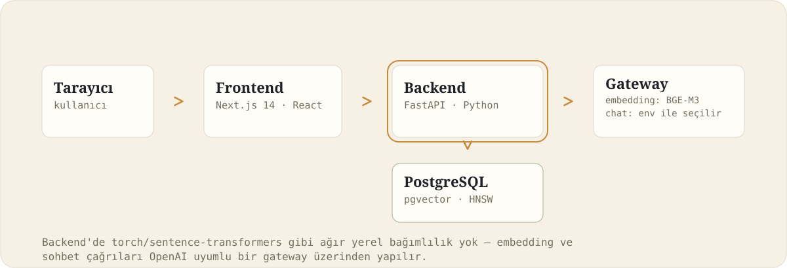

# Belge Arşivi — Document RAG Platform

Belgelerini (PDF, DOCX, TXT) yükle; sistem onları parçalayıp vektörler, sen de yalnızca o belgelerin içeriğine dayanan, kaynağı gösterilen yanıtlar alarak sohbet edersin. Uydurma cevap yok — bağlamda olmayan bir bilgi sorulduğunda sistem bunu açıkça söyler.

<p align="center">
  
</p>

## Bir bakışta

| Alan | Değer |
|---|---|
| Tür | Belge tabanlı RAG (Retrieval-Augmented Generation) sohbet platformu |
| Girdi | PDF · DOCX · TXT |
| Vektör deposu | PostgreSQL + pgvector (HNSW indeksi) |
| Embedding | BAAI/bge-m3, asimetrik talimatla (parça ≠ sorgu) |
| Alaka eşiği | Kosinüs benzerliği ≥ 0.52 — altındaki sorgular sohbet moduna düşer |
| Sohbet modeli | OpenAI uyumlu gateway, `CHAT_MODEL` env değişkeniyle seçilir |
| Dağıtım | Docker Compose (postgres · redis · minio · backend) + `npm run dev` (frontend) |
| Durum | Tek-kullanıcılı yerel geliştirme sürümü |

## Yapar / Yapmaz

| Yapar | Yapmaz |
|---|---|
| Belgeyi kelime sınırından kesmeden parçalara böler | Kimlik doğrulama veya kullanıcı ayrımı yapmaz |
| Yanıtı yalnızca yüklenen belgelerin içeriğine dayandırır | Çoklu tenant / workspace izolasyonu sağlamaz |
| "Selam" gibi alakasız mesajları benzerlik eşiğiyle ayırt edip sohbet moduna düşürür | Arka planda kuyruk/worker çalıştırmaz — yükleme senkron işlenir |
| Her yanıtın altında hangi belge(ler)den geldiğini gösterir | Orijinal dosyayı saklamaz — yalnızca çıkarılan metin + vektör tutulur |
| Parça ve sorgu embedding'lerini ayrı talimatlarla, asimetrik üretir | Sayfa numarası bazlı kaynak göstermez |

## Mimari

<p align="center">
  
</p>

| Katman | Teknoloji | Neden |
|---|---|---|
| Frontend | Next.js 14 (App Router) + TypeScript | Sunucu ve istemci bileşenlerini tek projede yönetir; dosya yükleme, canlı durum ve sohbet ekranları için uygun. |
| Stil | Tailwind CSS | Tasarım tokenlarını (renk, tipografi) tek yerden yönetip tutarlı bir görünüm kurmayı hızlandırır, ayrı bir CSS dosyası bakımı gerektirmez. |
| Backend | FastAPI + SQLAlchemy | Async destekli, Pydantic ile otomatik veri doğrulama ve OpenAPI (`/docs`) üretimi sağlar; Python olması belge işleme kütüphaneleriyle doğal uyum sağlar. |
| Veritabanı | PostgreSQL + pgvector | Belge/sohbet verisiyle vektörleri aynı veritabanında, tek transaction içinde tutar — ayrı bir vektör DB'si ve senkronizasyon problemi çıkarmaz. |
| Embedding | BAAI/bge-m3 (OpenAI uyumlu gateway üzerinden) | Çok dilli ve Türkçe'de güçlü bir embedding modeli; gateway üzerinden hosted API olarak çağrıldığı için yerelde ~2GB model indirip GPU/CPU'da çalıştırmaya gerek kalmaz. |
| Sohbet modeli | `CHAT_MODEL` env değişkeniyle seçilir (aynı gateway) | Kurumun zaten sağladığı modelle çalışır — ayrı bir LLM sağlayıcısı/API anahtarı gerektirmez, model değişimi kod değişikliği istemez. |
| Belge ayrıştırma | PyPDF2 (PDF), python-docx (DOCX) | MVP kapsamındaki iki temel formatı ek bağımlılık yükü olmadan okur. |
| Dağıtım | Docker Compose | Postgres, Redis, MinIO ve backend'i tek komutla, birbirine bağımlı şekilde ayağa kaldırır; yerel geliştirmede Kubernetes gibi bir orkestrasyon katmanına gerek yoktur. |

Embedding ve sohbet modelleri OpenAI-uyumlu bir gateway üzerinden çağrılır; backend'de torch/sentence-transformers gibi ağır yerel bağımlılıklar yoktur — bu hem başlatma süresini (dakikalar → saniyeler) hem de image boyutunu (9GB+ → ~530MB) büyük ölçüde azaltır.

## Hızlı başlangıç

1. `.env.example` dosyasını kopyalayıp kendi değerlerini gir (`.env`, `.gitignore`'da — commit edilmez):

   ```bash
   cp .env.example .env
   ```

2. Servisleri ayağa kaldır:

   ```bash
   docker compose up -d
   ```

3. Frontend'i başlat:

   ```bash
   cd apps/web
   npm install
   npm run dev
   ```

   Tarayıcıda `http://localhost:3000`.

Backend tek başına: `http://localhost:8000` (Swagger dokümantasyonu: `http://localhost:8000/docs`).

### İç ağdan (başka bir bilgisayardan) erişim

1. Windows Firewall'da 3000 ve 8000 portlarına gelen bağlantıya izin ver (yönetici olarak):

   ```powershell
   New-NetFirewallRule -DisplayName "RAG Frontend (3000)" -Direction Inbound -Protocol TCP -LocalPort 3000 -Action Allow
   New-NetFirewallRule -DisplayName "RAG Backend (8000)" -Direction Inbound -Protocol TCP -LocalPort 8000 -Action Allow
   ```

2. Arkadaşın, senin bilgisayarının IP adresiyle `http://<senin-ip>:3000` adresini açsın (localhost değil).

Frontend, backend'e istek atarken sayfayı açan tarayıcının kendi adresini (`window.location.hostname`) kullanır — bu yüzden arkadaşın kendi tarayıcısından açtığında istekler otomatik olarak senin makinene gider, kendi `localhost`'una değil.

## Veritabanına bağlanma

Bağlantı bilgileri `.env` dosyasında (`POSTGRES_USER`, `POSTGRES_PASSWORD`, `POSTGRES_DB`). Container zaten bu değerlerle ayağa kalktığı için kendi ortam değişkenlerini kullanabilirsin:

```bash
docker exec -it rag-postgres sh -c 'psql -U "$POSTGRES_USER" -d "$POSTGRES_DB"'
```

## Proje yapısı

```
document-rag-platform/
├─ apps/web/                Next.js frontend
│  ├─ app/                    sayfalar (ana sayfa, layout)
│  └─ components/             ChatWidget, Nav, ikonlar
├─ services/backend/         FastAPI backend
│  └─ src/
│     ├─ main.py                API endpoint'leri
│     ├─ db.py                  SQLAlchemy engine, pgvector kaydı, tablo oluşturma
│     ├─ models.py              Document / Chunk modelleri
│     └─ llm.py                 Embedding + sohbet gateway istemcisi
└─ docker-compose.yml        postgres (pgvector) · redis · minio · backend · web
```

## Bilinen sınırlamalar

Bu bir tek-kullanıcılı yerel geliştirme sürümüdür. Yukarıdaki "Yapmaz" sütununa ek olarak:

- Belge silme sırasında MinIO/nesne depolama temizliği yapılmaz (orijinal dosyalar zaten diske kalıcı yazılmıyor)
- 0.52 alaka eşiği, sınırlı sayıda gerçek sorguyla kalibre edildi — kullanım arttıkça yeniden ayarlanması gerekebilir

## Geliştirici

Mehmet Karacan
